~ number: 2b
~ title: Setting Up IntelliJ

Prerequisites
----
1. Java 8 - You finished lab 1b
2. You have successfully created your local repo for the class on your own machine. This is the 3-letter directory you created and set up in lab 1.

Installing IntelliJ
----

<<<<<<< HEAD
=======
If you're working on the lab computers, skip this step.

>>>>>>> 734ed5ac9d1021a31ed8845942be822584d488a1
1. You'll need to install the Community Edition of IntelliJ from the [Jetbrains](https://www.jetbrains.com/idea/download/) website.

2. After selecting the appropriate version for your OS (Mac OSX, Windows, or Linux), click download and wait a few minutes for the file to finish downloading.

3. Run the install file and follow the prompts to install IntelliJ onto your computer. You can stick to all the default settings. Feel free to install IdeaVim if you're a vim user.

Project Setup
----
IntelliJ is an IDE (Interactive Development Environment). It's like a text editor (ie Sublime) but it's chock full of extra features. In order to run your files in this special environment where we can work our IDE magic, we need to import our files into a project, similar to how you might import images or clips into a project for a program like iMovie or Windows Movie Maker. Fortunately, this is a fairly painless process.

These instructions apply for both initial setup and for future assignments. When you run `git pull skeleton master` to retrieve a new assignment and you notice that you have a new assignment directory (next week, you'll have lab3/) simply run through these steps again from 1 to 8. This will likely involve pressing next for all steps and, if IntelliJ asks you to overwrite various housekeeping files (such as .iml files) because they already exist, respond "Yes" or "Overwite" to those popup windows. This is so IntelliJ can automatically mark the new directories for your assignment to work with IntelliJ for you as opposed to you manually marking directories as source folders and/or modules.

<<<<<<< HEAD
=======
Begin the setup process by starting up IntelliJ. If you're on one of the lab computers, use the command `/share/instsww/bin/idea.sh` command in a terminal window to start IntelliJ. Then follow the steps below.

>>>>>>> 734ed5ac9d1021a31ed8845942be822584d488a1
1. Upon opening IntelliJ, click on the "import project" option.
	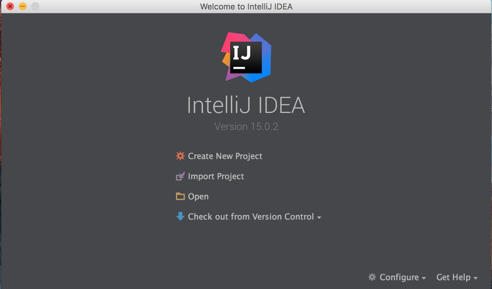
	
2. Find and choose your 3-letter repo/directory then press the ok button. Don't worry if yours doesn't have all the assignments; yours will look like this by the end of the course! From here on out, you should be able to simply select next for every screen but to be safe in the face of shenanigans, more screenshots follow. 

If you get to a point where you see a message that says No SDK specified, stop at step 8!

	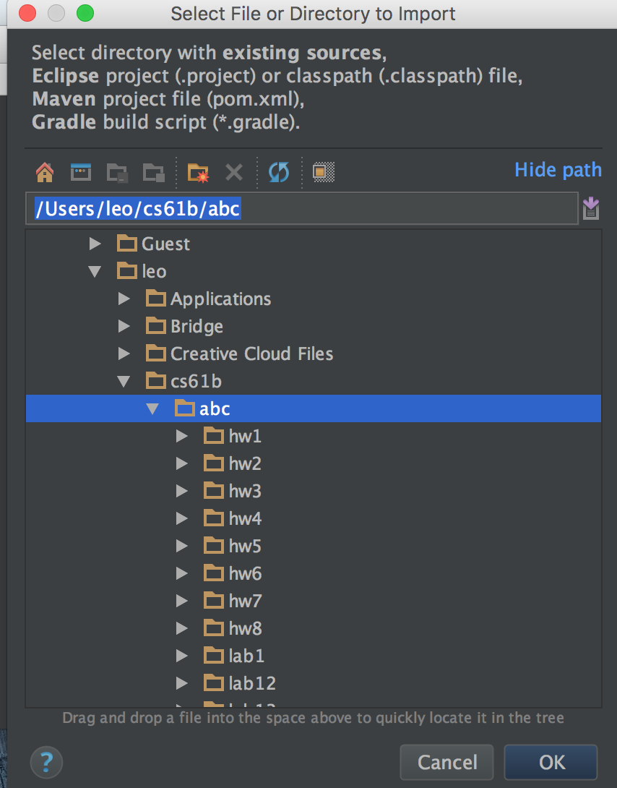
	
3. Make sure "Create project from existing sources" is selected and press next. You shouldn't have to change anything at this step.
	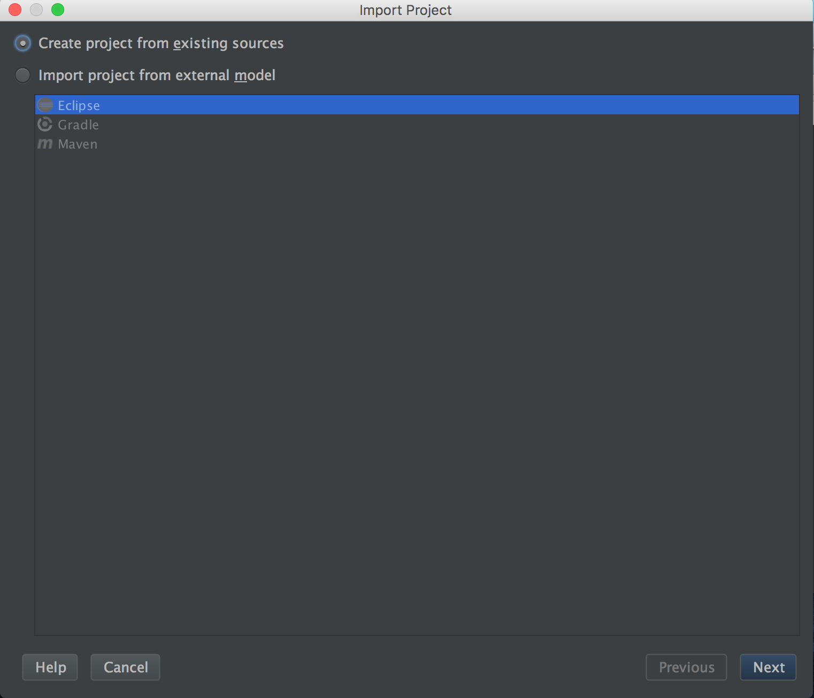
	
4. Leave theses fields untouched and press next.
	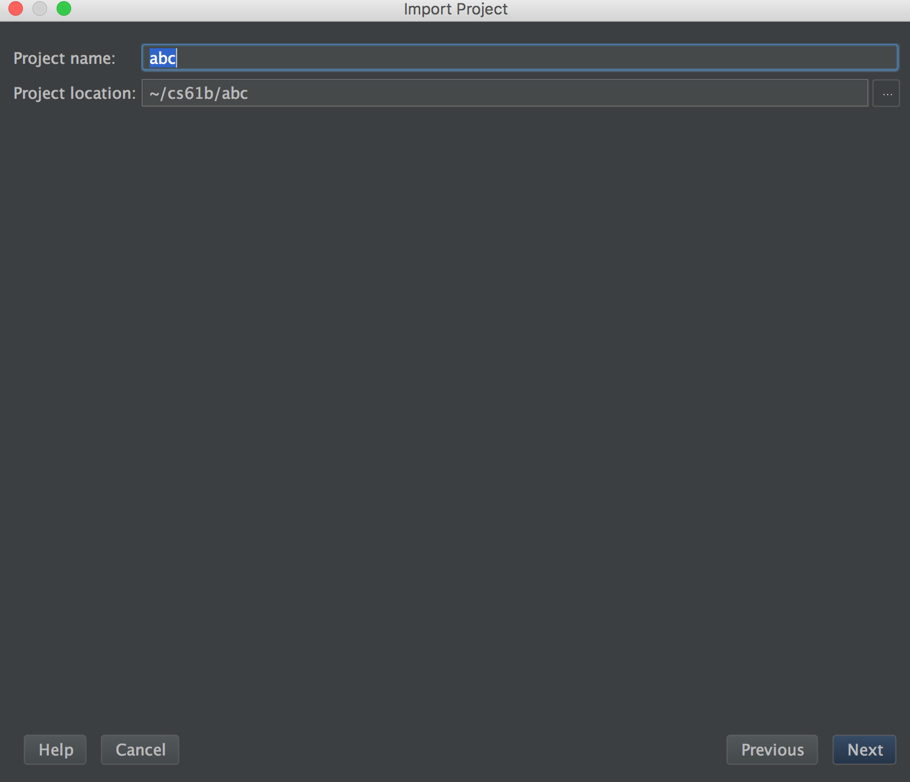
	
5. Do nothing here and press next. For context, IntelliJ is automagically detecting what your Java files are and self-configuring itself to edit and run them. Once again, don't be scared about the large number of files here; yours should only contain lab1 and maybe lab2 (if you've pulled lab2 already).
	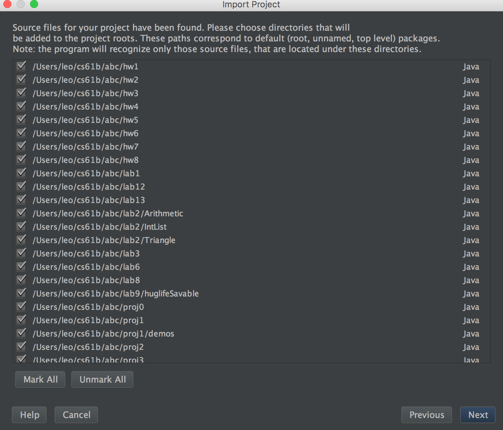
	
6. Once again, do nothing and press next. This step, we are importing all the jars (Java ARchives) we've given that some of the programs we give you and you write might depend on.
	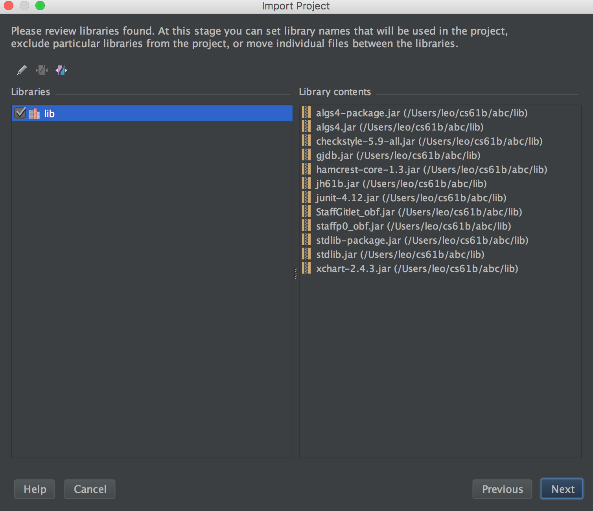
	
7. This screen might not pop up for you; that's fine. If it does, that's also fine. Press next.
	
	
8. SLOW DOWN!!! You actually might need to do something here! If you see 1.8 on the left sidebar, you're in the clear and can simply press next then click finish on the final screen and voila, your project is set up and you can skip steps 9 and 10! Otherwise, continue on to steps 9 and 10.
	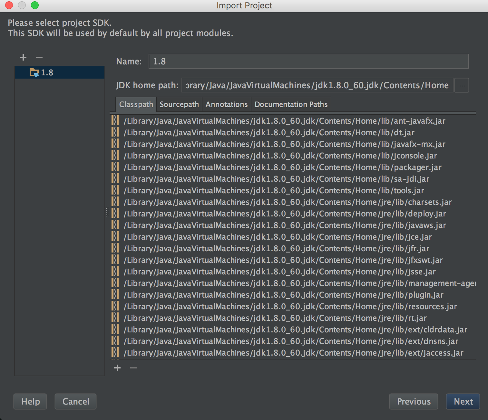

9. Click the plus in the upper left corner and click jdk from the drop-down menu
	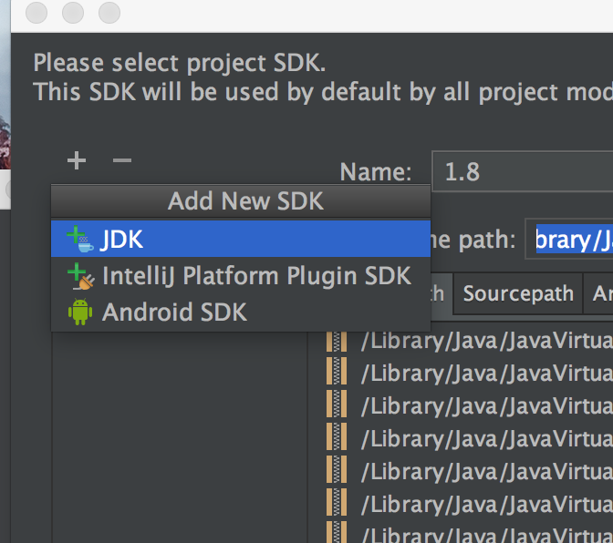

<<<<<<< HEAD
10. Find where your jdk is saved, select it, and press ok button. On my Mac, it was at "/Library/Java/JavaVirtualMachines/jdk1.8.0\_60.jdk/Contents/Home". If you're on Windows, your path may look like "C:\Program Files\Java\jdk1.8.0\_65". Once this window closes and your screen looks like the image at step 8, press next, then finish, and you're done!
=======
10. Find where your jdk is saved, select it, and press ok button. On my Mac, it was at "/Library/Java/JavaVirtualMachines/jdk1.8.0\_60.jdk/Contents/Home". If you're on Windows, your path may look like "C:\Program Files\Java\jdk1.8.0\_65". If you're on a lab computer, it should be at "/usr/lib/jvm/Java-8-oracle/". Once this window closes and your screen looks like the image at step 8, press next, then finish, and you're done!
>>>>>>> 734ed5ac9d1021a31ed8845942be822584d488a1
	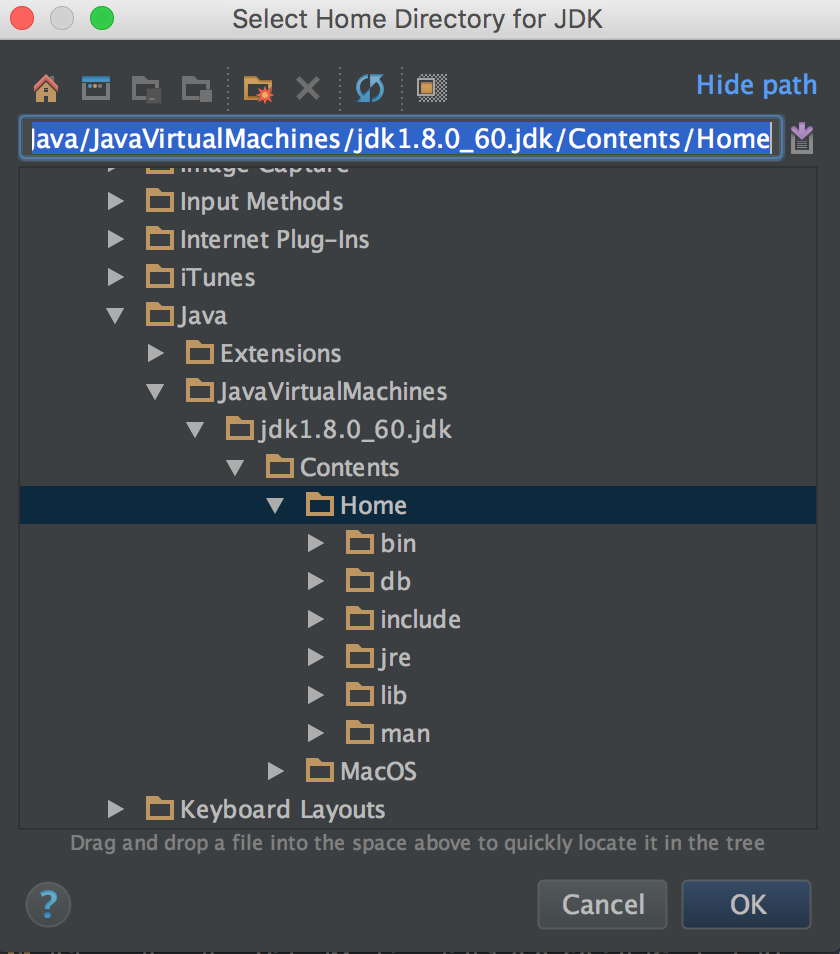

Relax for a Bit
----
The first time you start up IntelliJ it's going to spend some time indexing files. This may take a few minutes. There should be a little progress bar in the bottom right. Once it's done, a sidebar will appear.
	
Sanity Check
----
To test that your program works, use the sidebar of your workspace to navigate to the program you wrote in lab1 (Year.java), right click either the java file in the navigation sidebar on the left or on the text editor portion of the IDE and select the run option. 
	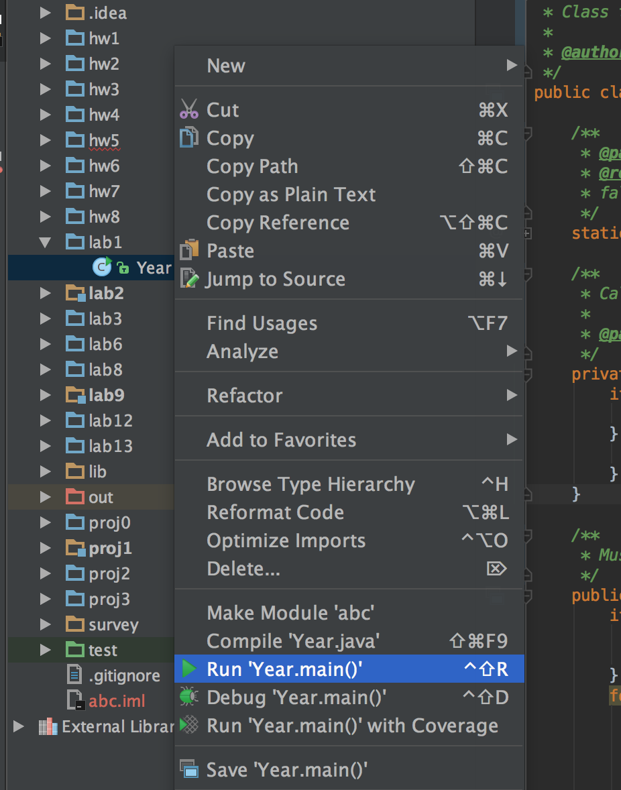

<<<<<<< HEAD
You may get an error about "duplicate classes" in your proj0 directory. The problem is that we have copies of StdDraw.java, StdIn.java, and In.java in both the proj0 and proj0/examples folder. This wasn't a problem before because command line compilation using `javac` for proj0 only considered .java files in the folder at the time you called `javac`. However, IntelliJ has a much wider field of view, and treats your entire login folder as one huge project, getting very upset if it sees two classes with the same name.

To fix this error, simply delete StdDraw.java, StdIn.java and In.java from your proj0/examples directory. This means that you won't be able to run the demos from the command line anymore (unless you use IntelliJ to run them). Project 0 should still work.
=======
You may get an error about "duplicate classes" in your proj0 directory. The problem is that we have copies of StdDraw.java, StdOut.java, and In.java in both the proj0 and proj0/examples folder. This wasn't a problem before because command line compilation using `javac` for proj0 only considered .java files in the folder at the time you called `javac`. However, IntelliJ has a much wider field of view, and treats your entire login folder as one huge project, getting very upset if it sees two classes with the same name.

To fix this error, simply delete StdDraw.java, StdOut.java and In.java from your proj0/examples directory. This means that you won't be able to run the demos from the command line anymore (unless you use IntelliJ to run them). Project 0 should still work.
>>>>>>> 734ed5ac9d1021a31ed8845942be822584d488a1

<!--To fix this error, open Settings/Preferences (under the File tab or the IntelliJ IDEA tab).  In the Settings/Preferences menu, on the left-side bar, go into Build,Execution,Deployment -> Compiler -> Excludes.  In the Excludes menu, add StdDraw.java, StdOut.java, In.java, and StdAudio.java from your proj0 directory, then hit OK.-->

You'll notice after this, the green play and green bug icons in the upper right (next to the right bug) are now green; this is because the previous step set up the run configuration for this program and you can now click this button to run your program. You should also notice in the console below the text editor, your program ran but your program should have printed something stating you need to input command line arguments. We'll go over inputting command line arguments in lab2, our IDE features lab.
	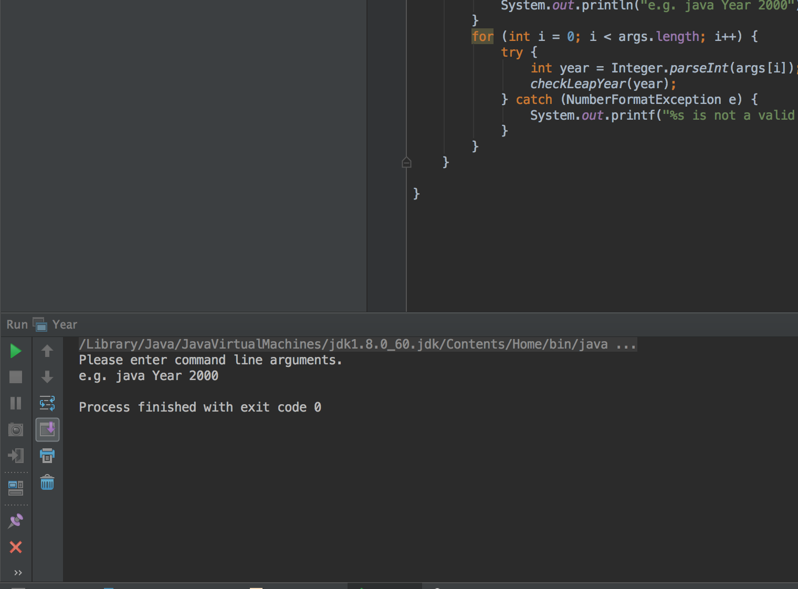

Embedded Terminal (Optional)
----

IntelliJ has the cool feature that you can have a working terminal in the workspace so you don't have to constantly switch between having IntelliJ and your terminal, if that becomes necessary for whatever reason.

For Mac users, you should be able to skip this setup section. Windows users will likely have to put in a little leg work. This setup assumes you are a Windows user and you have git bash installed.

First, find the preferences/settings tab and select it (Or use Ctrl+alt+s)

Type in "terminal" in the search bar. Once there, type in "C:\Program Files (x86)\Git\bin\sh.exe --login -i" into the Shell Path field. Click ok.

To test if you've properly set this up, hover over the little box in the bottom left corner and select terminal; the bottom third of your screen should now be a terminal, the equivalent of having git bash right there.

Try typing something in! If you're able to run basic commands like "ls" or "cd" or "echo 'Hello world'" you've done it!

	

